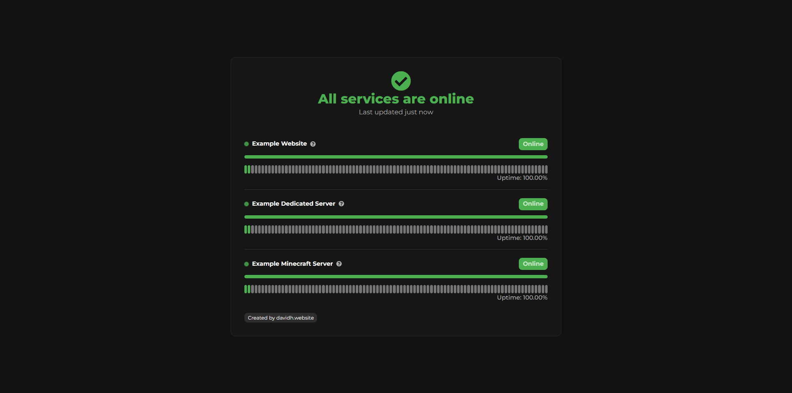

# Nectory Status
Nectory Status is a open-source, self-hosted status page that gives you control over your server monitoring without ongoing costs. This project was created for learning purposes.

## Features

- **Automated Monitoring**  
  Get real-time updates on your services’ uptime with fully automated checks.
  
- **Unlimited Service Monitoring**  
  Keep track of as many services as you need—no limits.
  
- **Discord Webhook Integration**  
  Receive instant updates via Discord through webhook notifications.
  
- **Support for Multiple Service Types**  
  Monitor not only websites but also Minecraft, IPS, UDP, and TCP services effortlessly.
  
- **Self-Hosted**  
  Complete control by hosting the status page on your own servers.
  
- **Easy Setup**  
  Simple to install and configure—get up and running in no time.
  
- **Database-Free**  
  No database setup required, making installation easier and quicker.
  
- **Historical Uptime Tracking**  
  View and analyze past uptime data for all your services.
  
- **Fully Responsive Design**  
  Optimized for all devices—desktop, tablet, or mobile.

### Installation

1. **Clone the repository**  
   ```bash
   git clone https://github.com/DavidH45/NectoryStatus.git
   ```
2. **Navigate into the project directory**  
   ```bash
   cd NectoryStatus
   ```
3. **Install Dependencies**  
   ```bash
   npm i
   ```
4. **Start Nectory Status**  
   ```bash
   npm start
   ```
5. **Server is online on port 3000 by default**

